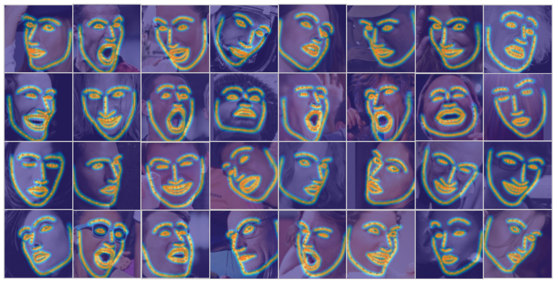
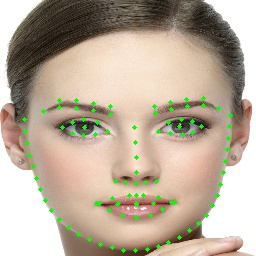

### etos-landmark

a high accuracy facial landmark detection model, for [ETOS](https://etos.world) Ecosystem.

### Look at Boundary: A Boundary-Aware Face Alignment Algorithm

Created by [Wayne Wu](https://wywu.github.io/).



boundary-aware face alignment algorithm achieves 3.49% mean error on 300-W Fullset, which outperforms state-of-the-art methods by a large margin.

## Prerequisites
- Linux
- Python3.6 is tested
- NVIDIA GPU + CUDA CuDNN is tested

### Getting Started

### Installing
0. Install prerequisites for Caffe (http://caffe.berkeleyvision.org/installation.html#prequequisites, cuda may be needed)
1. ```git clone https://github.com/etosworld/etos-landmark```
2. ```make all```
3. ```./compile.sh```
4. run ```./caffe_LAB``` to see one simple image result



### Wider Facial Landmark in the Wild (WFLW) Dataset Download
[Wider Facial Landmarks in-the-wild (WFLW)](https://wywu.github.io/projects/LAB/WFLW.html) is a new proposed face dataset. It contains 10000 faces (7500 for training and 2500 for testing) with 98 fully manual annotated landmarks.

0. WFLW Training and Testing images [[Google Drive](https://drive.google.com/open?id=1hzBd48JIdWTJSsATBEB_eFVvPL1bx6UC)] [[Baidu Drive](https://pan.baidu.com/s/1paoOpusuyafHY154lqXYrA)]
1. WFLW [Face Annotations](https://wywu.github.io/projects/LAB/support/WFLW_annotations.tar.gz)
2. Unzip above two packages and put them on './datasets/WFLW/'

Simply run this script to download annotations of WFLW
```bash
#! ./scripts/download/download_wflw_annotation.sh
bash ./scripts/download/download_wflw_annotation.sh WFLW
```

### Refer


